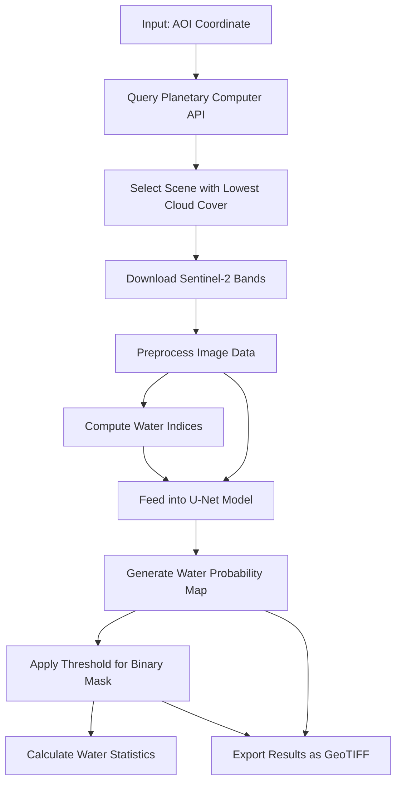

# HydraNet: Rilevamento di Aree Umide da Immagini Sentinel-2


[](https://colab.research.google.com/github/BaterHub/HydraNet-Wetland-Detection/blob/main/Wetland_detection.ipynb)

## 📋 Panoramica

Wetland_detection è un progetto di deep learning per il rilevamento automatico di aree umide (laghi, fiumi, bacini idrici). Utilizzando immagini multispettrali Sentinel-2 accessibili tramite Microsoft Planetary Computer il notebook implementa l'architettura di rete neurale specializzata per il riconoscimento di corpi idrici che integra l'analisi spettrale con tecniche di warning idrologico.

### Caratteristiche principali:
- 🛰️ Download automatico di immagini Sentinel-2 dall'API di Planetary Computer
- 🧠 Implementazione di una rete neurale (U-Net)
- 💧 Utilizzo di indici idrici (NDWI, MNDWI) per migliorare il rilevamento
- 🗺️ Output di mappe di probabilità e maschere binarie in formato GeoTIFF
- 📊 Visualizzazione e quantificazione delle aree umide rilevate

## 🛠️ Requisiti

Per eseguire il notebook sono necessarie le seguenti dipendenze:

```
planetary-computer>=0.4.0
pystac-client>=0.4.0
rioxarray>=0.10.0
matplotlib>=3.5.0
numpy>=1.20.0
torch>=1.10.0
torchvision>=0.11.0
scikit-image>=0.18.0
geopandas>=0.10.0
earthpy>=0.9.0
folium>=0.12.0
rasterio>=1.2.0
```

È possibile installare tutte le dipendenze eseguendo:

```bash
pip install -r requirements.txt
```

## 📚 Struttura del Repository

```
├── README.md                       # Documentazione principale
├── requirements.txt                # Requisiti Python
├── HydraNet_Wetland_Detection.ipynb # Notebook principale
├── data/                           # Directory per i dati (vuota, verrà riempita dal notebook)
├── outputs/                        # Directory per i risultati (vuota, verrà riempita dal notebook)
├── docs/                           # Documentazione aggiuntiva
└── LICENSE                         # Licenza del progetto
```

## 🚀 Getting Started

### 1. Clona il repository

```bash
git clone https://github.com/username/hydranet-wetland-detection.git
cd hydranet-wetland-detection
```

### 2. Crea un ambiente virtuale (opzionale ma consigliato)

```bash
python -m venv venv
source venv/bin/activate  # Per Linux/Mac
# oppure
venv\Scripts\activate     # Per Windows
```

### 3. Installa le dipendenze

```bash
pip install -r requirements.txt
```

### 4. Avvia Jupyter Notebook

```bash
jupyter notebook
```

### 5. Apri il notebook `HydraNet_Wetland_Detection.ipynb` e segui le istruzioni

## 📖 Come utilizzare il notebook

Il notebook è organizzato in sezioni logiche e commentate:

1. **Installazione delle dipendenze**: Setup iniziale dell'ambiente.
2. **Connessione a Planetary Computer e ricerca di immagini**: Configurazione dell'accesso all'API e ricerca di scene Sentinel-2.
3. **Download e preprocessing dell'immagine satellitare**: Acquisizione e preparazione dei dati.
4. **Implementazione di U-Net**: Definizione dell'architettura del modello e download dei pesi pre-allenati.
5. **Preprocessing e applicazione del modello**: Elaborazione dell'immagine e inferenza.
6. **Visualizzazione e analisi dei risultati**: Rappresentazione grafica dei risultati.
7. **Analisi quantitativa delle aree umide rilevate**: Calcolo di statistiche sulle aree rilevate.
8. **Salvataggio dei risultati**: Esportazione dei risultati in formato GeoTIFF.

### Personalizzazione dell'area di interesse

Per modificare l'area geografica di analisi, aggiorna le coordinate dell'Area di Interesse (AOI) nella sezione 1:

```python
# Definiamo un'area di interesse (AOI)
lon_min, lat_min, lon_max, lat_max = 15.7, 40.0, 15.9, 40.2  # Esempio: Lago Sirino, Italia
```

### Addestramento del modello

⚠️ **Nota**: Il notebook attualmente utilizza un modello con pesi pre-addestrati.

Per addestrare il modello su un dataset personalizzato, è necessario:
1. Preparare un dataset di immagini Sentinel-2 con maschere binarie di riferimento per le aree umide
2. Implementare la funzione di loss (es. Binary Cross-Entropy)
3. Configurare l'ottimizzatore e il loop di addestramento
4. Monitorare le metriche di addestramento (es. IoU, F1-score)

Un esempio di codice per l'addestramento sarà fornito in futuro.

## 🔍 Dettagli tecnici

### Architettura CNN

L'architettura di segmentazione semantica è basata su U-Net con le seguenti caratteristiche:

- **Backbone ResNet34**: Estrazione robusta di caratteristiche visive.
- **Modulo di warning idrologico**: Combina indici d'acqua (NDWI, MNDWI) con caratteristiche della CNN.
- **Skip connections**: Preserva informazioni spaziali attraverso il downsampling/upsampling.

<details>
  <summary>Schema dell'architettura U-Net</summary>
  
  ```
  Input Image [6 channels: B, G, R, NIR, SWIR1, SWIR2]
     ↓
  +-------------------+    +------------------+
  | Feature Extraction | -> | Water Indices    |
  | (ResNet Backbone)  |    | (NDWI, MNDWI)    |
  +-------------------+    +------------------+
     ↓                           ↓
  +-------------------+    +------------------+
  | Encoder Path       |    | Hydrological     |
  | (Downsampling)     |    | Warning Module   |
  +-------------------+    +------------------+
     ↓                           ↓
  +----------------------------------------+
  | Decoder Path                           |
  | (Upsampling + Skip Connections)        |
  +----------------------------------------+
     ↓
  +----------------------------------------+
  | Output: Water Probability Map          |
  +----------------------------------------+
  ```
</details>

### Indici idrologici utilizzati

- **NDWI (Normalized Difference Water Index)**:
  ```
  NDWI = (Green - NIR) / (Green + NIR)
  ```
  
- **MNDWI (Modified Normalized Difference Water Index)**:
  ```
  MNDWI = (Green - SWIR1) / (Green + SWIR1)
  ```

### Risoluzione spaziale

Il modello utilizza le seguenti bande Sentinel-2:
- **B02 (Blue)**, **B03 (Green)**, **B04 (Red)**, **B08 (NIR)**: 10m di risoluzione
- **B11 (SWIR1)**, **B12 (SWIR2)**: 20m di risoluzione (ricampionate a 10m)

## 🔄 Pipeline di elaborazione



## 📝 Come citare

Se utilizzi questo progetto nella tua ricerca, per favore cita:

```
@software{hydranet_wetland_detection,
  author = {Patrizio Petricca},
  title = {Rilevamento di Aree Umide da Immagini Sentinel-2},
  year = {2025},
  url = {https://github.com/BaterHub/HydraNet-Wetland-Detection}
}
```

## 🔗 Link utili

- [Microsoft Planetary Computer](https://planetarycomputer.microsoft.com/)
- [Sentinel-2 User Guide](https://sentinel.esa.int/web/sentinel/user-guides/sentinel-2-msi)
- [PySTAC Client Documentation](https://pystac-client.readthedocs.io/)
- [RioXArray Documentation](https://corteva.github.io/rioxarray/stable/)

## 📄 Licenza

Questo progetto è distribuito con licenza MIT. Vedi il file `LICENSE` per maggiori dettagli.

## 👥 Contributi

I contributi sono benvenuti! Per favore, leggi `CONTRIBUTING.md` per le linee guida su come contribuire al progetto.

## 📧 Contatti

Per domande o suggerimenti, contattare [patrizio.petricca@yahoo.it](mailto:patrizio.petricca@yahoo.it) o aprire un Issue su GitHub.